# 🕰️ Terminal Time Traveler

A fun and educational C++ CLI application that helps you explore alternate historical events using data from multiple JSON files — all through a Dockerized terminal interface!


## 🤔 Why This Project?

Large JSON datasets are common in software systems — from logs to APIs, configs, or even historical records. Terminal Time Traveler mimics a practical use-case:

> 📂 "What if you had thousands of entries and wanted to quickly fetch events for a specific year without manually combing through raw data?"

This tool solves that with:
- Instant year-based filtering
- CLI-based exploration
- Extensibility via modular JSONs

It also serves as an **educational reference** for:
- C++ file parsing
- `nlohmann::json` usage
- Docker-based C++ development workflow


## ⚙️ Design Decisions

- **JSON Format**: Chosen for simplicity and human-readability.
- **nlohmann/json**: Modern C++ JSON parser with clean STL-like API.
- **Modular JSON support**: Enables splitting timelines into domains (e.g., science, politics, space).
- **CLI UX**: Inspired by terminal-based retro interfaces.
- **Dockerization**: Ensures platform independence — "runs anywhere, works every time".


## 🔧 How to Extend

Want to add more timelines or functionality? Here's how:

1. 📁 **Add more JSON files** under `data/` like `science.json`, `sports.json`.
2. 🧠 **No code change needed** – All `.json` files are auto-loaded.
3. 🛠️ Add new commands to `main.cpp` if you want richer CLI logic.
4. 🧪 Add tests using C++ test frameworks like `Catch2`.

Optional Ideas:
- Fuzzy year search (`194` matches `1947`, `1945`)
- Event keyword search
- Categorized listing (timeline types)


## 🚀 Features

- Parses and loads multiple `.json` files from the `/data` folder.
- Interactive command-line interface (CLI).
- Filters and displays timeline events by year.
- Demonstrates JSON parsing using `nlohmann/json`.
- Fully containerized with Docker and Docker Compose.

## 🛠️ Tech Stack

- C++17
- nlohmann/json
- Docker
- GNU Make

## 📂 Project Structure
```bash
terminal-time-traveler/
├── bin/                    # Compiled binary
├── data/                  # Timeline JSON files
│   ├── timeline.json
│   ├── timeline2.json
│   └── timeline3.json
├── include/
│   └── timeline.hpp       # Timeline class header
├── src/
│   ├── main.cpp           # Main CLI logic
│   └── timeline.cpp       # Timeline class definition
├── Dockerfile             # Docker setup
├── docker-compose.yml     # Compose config
├── Makefile               # Compilation instructions
└── README.md              # Project guide
```


## 🧠 How It Works

### 🔄 Functional Flow

```mermaid
graph TD
    A[Start Application] --> B[Load JSON files from /data]
    B --> C[Parse using JSON parser]
    C --> D[Populate Map: year → event]
    D --> E[User CLI input: list, year, exit]
    E --> F[If year: show event]
    E --> G[If list: show all years]
    E --> H[If exit: quit]
```


## 🧾 JSON Parsing

```json
{
  "1991": "Soviet Union dissolves.",
  "2020": "Alternate pandemic discovery."
}
```

## 🔄 Converted Internally To:

```cpp
std::unordered_map<std::string, std::string> timelineData;

timelineData["1991"] = "Soviet Union dissolves.";
```


## 🧪 Usage

### ⬇️ Clone & Build with Docker

```bash
git clone https://github.com/techmedaddy/terminal-time-traveler.git
cd terminal-time-traveler
docker-compose up --build
```


## 💡 CLI Commands

- `list` : Lists all available years.
- `2001` (any year): Displays event for that year.
- `exit` : Closes the program.


### 📸 Screenshots


   ### 📚 Diagram 

#### 1. **High-Level Architecture**
**Type**: Block Diagram

```
+------------------------+
| User Input via CLI     |
+-----------+------------+
            |
            v
+-----------+------------+
| Timeline Class (C++)   |
| - loadData()           |      
| - getEvent()           |
| - listYears()          |
+-----------+------------+
            |
            v
+-----------+------------+
| Multiple JSON files    |
| from /data/            |
+------------------------+
```


#### 2. **Docker Workflow**

**Type**: Flow Diagram
```
[Local Code] --> [Dockerfile] --> [Image Built]
↓
[docker-compose up]
↓
[Containerized CLI]
```


## ✅ TODOs

- [x] Dockerize the project
- [x] Parse multiple JSONs
- [ ] Add unit tests
- [ ] Export events to file


# 🧑‍💻 Author
### Umar Ejaz Imam


# 🏁 License

MIT License © 2025 Umar Ejaz Imam


## 🤝 Contributing
Contributions are welcome! Please open issues or pull requests for improvements or new features.


